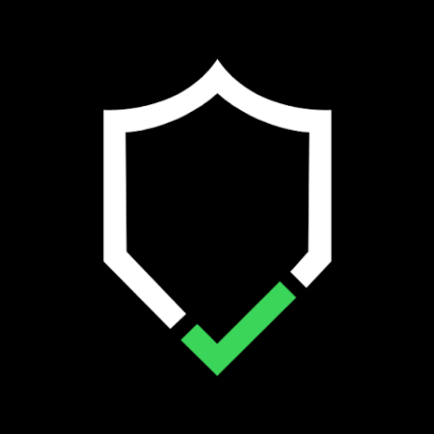
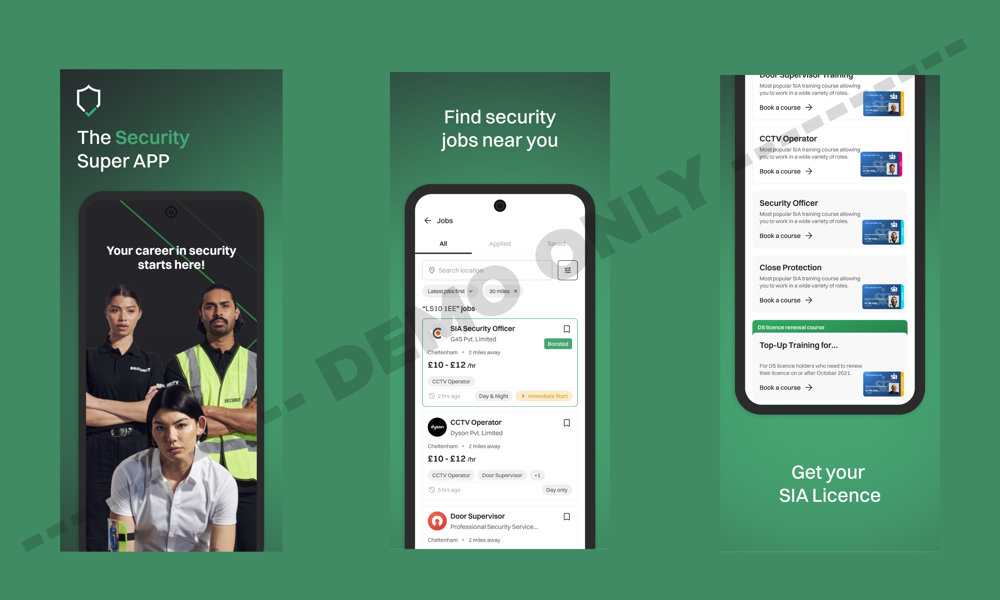
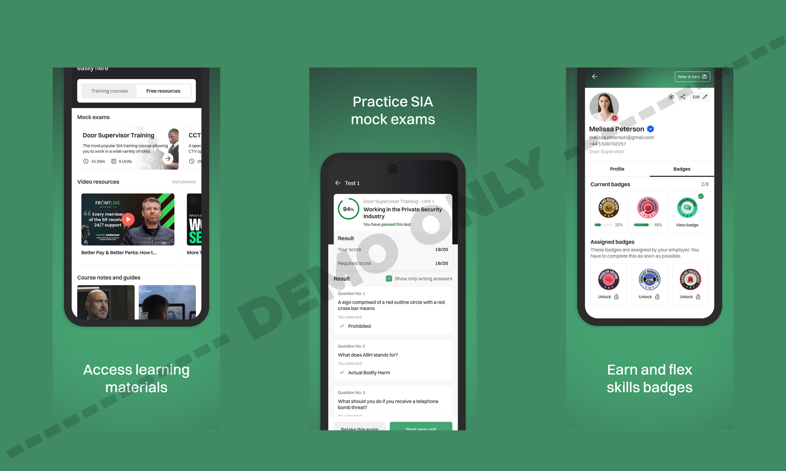

# 🛡️ Guard Pass (For Demo Use Only)
### Industrial Portfolio — UI Showcase  
**Note:** This application belongs to **Get-Licensed**.  
This repository is created **only for demo and presentation purposes** to showcase UI work, improvements, and contributions.

---

## 📌 About the App

**Guard Pass** is a professional-grade mobile application used in the security industry for guard operations, access management, and logging activities.  
This demo repository does **not** contain production code, backend logic, or proprietary implementation.  
It only includes **visual previews** strictly for portfolio and hiring review.

---

## 👨‍💻 My Role & Contributions

I worked on integrating and improving multiple modules within the Guard Pass app:

- 🎥 **Implemented video recording functionality**  
- ▶️ **Integrated custom video player screens**  
- 🛠️ **Fixed bugs, crashes, and UI inconsistencies left by previous developers**  
- 🎨 **Enhanced layouts and polished UI elements**  
- 📱 **Improved screen transitions and modern UI styling**

This portfolio highlights the **overall interface and system flow** I worked on, without exposing proprietary code.

---

## 🧩 Demo Assets Included  

This repository contains **only the following items**:

- ✔ **App Icon**  
- ✔ **Two landscape showcase strips** (showing multiple screens)  
- ❌ No source code  
- ❌ No backend logic  
- ❌ No proprietary files  

Everything presented is strictly for **visual demonstration**.

---

## 🖼️ Visual Preview

### **App Icon**

---

### **Showcase — Landscape Preview 1**

---

### **Showcase — Landscape Preview 2**

---

## 📥 Download (Official Links)

> Note: These links belong to the **original Get-Licensed application**, not this portfolio.

**Google Play:**  
[View it on Google Play](https://play.google.com/store/apps/details?id=com.getlicensed.protect.released&hl=en)

**App Store:**  
[View it on App Store](https://apps.apple.com/pk/app/guardpass-by-get-licensed/id1562863073)

---

## 📄 Disclaimer

This repository is **not affiliated with, endorsed by, or officially representing Get-Licensed**.  
It is intended **solely to demonstrate my UI contributions and integration work**.  
All rights to the original application belong to **Get-Licensed**.

---

## 📬 Contact

For professional work, collaborations, or UI development:

**Email:** hamzabilalgaya.bilal@gmail.com  
**LinkedIn:** [View my LinkedIn Profile](https://www.linkedin.com/in/hamza-bilal-g-4259a8181)  
**Fiverr:** [View my Fiverr profile](https://www.fiverr.com/s/EgZdxBK)
**Upwork:** [View my Upwork profile](https://www.upwork.com/freelancers/~01474d05eaa4a6e38b)  

---

## ⭐ Support My Work

If you like my work and want to support future UI components, tutorials, and open source:

### ☕ **Buy Me a Coffee**  

---

